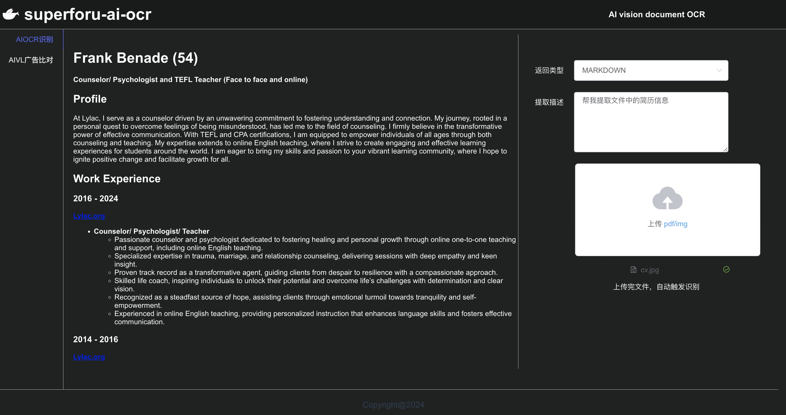

# superforu-ai-ocr



A very simple way of OCR-ing a document of AI vision.  
Documents are meant to be a visual representation after all.  
With weird layouts, tables, charts, etc.   
The vision models just make sense!   

The general logic:
- Pass in a file (pdf, image, etc.) 
- Convert that file into a series of images 
- Pass each image to AI vision LLM and ask nicely for Markdown 
- Aggregate the responses and return Markdown or JSON

# Getting Started
cuda: 12.4  
gpu: 24G
## Backend
```
# Create python env and install requirements
conda create --name superforu-ai-ocr python=3.11
conda activate superforu-ai-ocr
pip install -r requirements.txt

# Install pytorch, ref: https://pytorch.org/get-started/locally
pip install torch torchvision torchaudio

# Start server
python src/App.py
```

## Frontend
Update backend API [baseURL]: api/api.js
```
cd ui
npm i
npm run dev
http://127.0.0.1:8080
```

# Example Output
